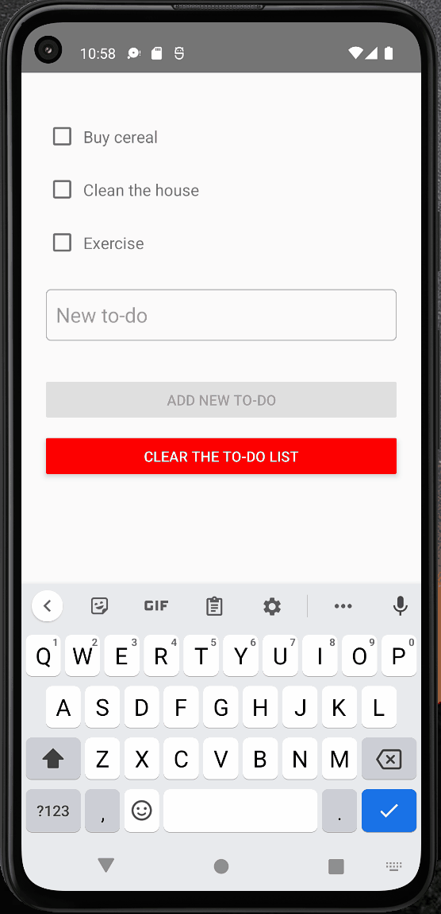

# Weather App 

#### By Kyle Miller

## Technologies Used
* React Native or React
* JavaScript 
* HTML
* CSS
* Firebase

## Description

_A React application that will check the weather for your current location or in other places and display your location, degrees, and other additional data._

## Research and Planning Log
### Thursday, 8/25
* 8:30-9:30 TodoApp with React Native and firebase: https://blog.logrocket.com/storing-retrieving-data-react-native-apps-firebase/
### Friday, 8/26
* 1:30-4:00 Running your React Native application: https://reactnative.dev/docs/environment-setup
* 8:00-11:00 Bugs: Installed gradle to fix an gradle error 
### Saturday, 8/27
* 2:00-4:00 Finished ToDoApp with React Native and firebase
* 6:00-9:00 bug: stuck on a gradle error
